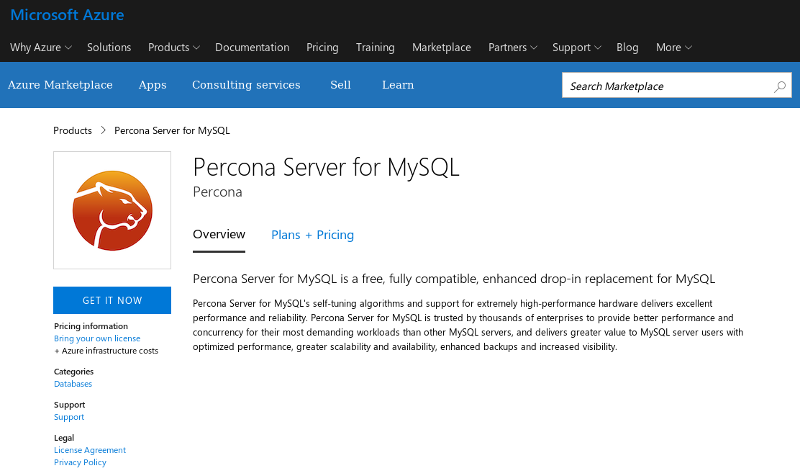

.. _azure_cloud:

===============================================
Deploying |Percona Server| on Azure Marketplace
===============================================

Microsoft Azure image of |Percona Server| is hosted publicly as `Azure Marketplace app <https://azuremarketplace.microsoft.com/en-us/marketplace/apps/percona.percona-server?tab=Overview>`_:

At least two things should be done to have |Percona Server| working on Azure:
`Deploying virtual machine`_ and `Configuring MySQL root access`_

Deploying virtual machine
=========================

The deployment on Azure cloud starts with clicking the **GET IT NOW** button,
seen on the previous screenshot, will bring a confirmation dialog to agree with
the provider's terms of use and privacy policy. Continuation would bring
information about Percona Server for MySQL, Percona's licensing and support.
Clicking **Create** button on the bottom proceeds to the first of four virtual
machine configuration steps.

1. *Basics settings* configuration includes the name of a virtual machine, type
   of the virtual disk (SSD or HDD), the user's login and authentication
   method, and providing either ssh key or password. Also the machine should be
   included into the existing resource group or to the new one on this step:

.. image:: azure03.png

2. *Size* step allows to chose a virtual appliance from available options
   with different sizes of RAM, processor and specific performance parameters:

   .. image:: azure04.png

3. *Settings* step involves networking configuration, and at least SSH
   access should be turned on on this step to get further access to the
   virtual machine:

   .. image:: azure05.png

4. *Summary* shows summary of the chosen configuration options and used payment
   plans, and **Create** button on the bottom would proceed to the actual
   creation of the virtual machine.

After the machine is created, an IP address shown in the machine info can be
used to access SSH configured in the standard way on port 22.

Configuring MySQL root access
=============================

The very first thing to do with a fresh MySQL installation is to change temporary MySQL root password with a more secure one. In case of `Azure Marketplace app <https://azuremarketplace.microsoft.com/en-us/marketplace/apps/percona.percona-server?tab=Overview>`_ this temporary password can be seen in ``/var/log/mysqld.log`` file:

   .. code-block:: bash

      $ sudo grep password /var/log/mysqld.log

When this password is known, it can be used to login ``mysql`` client with an
ordinary ``mysql -u root -p`` command. The recommended way to change password
is ``ALTER USER`` command: 

 .. code-block:: mysql

    mysql> ALTER USER 'root'@'localhost' IDENTIFIED BY 'my-new-password';

where 'my-new-password' should be substituted with a real password for the
MySQL root user. 
